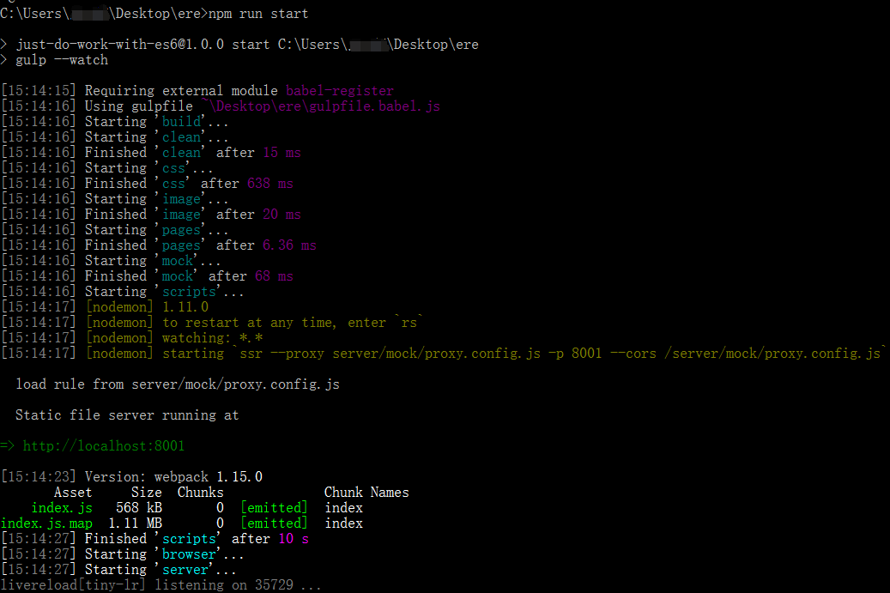
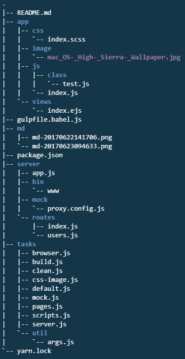

# 使用说明

1.使用了慕课网中的ES6-彩票教学课程实践中的老师的脚手架


可以快速的使用es6进行前端开发,根据自我的需求自己做了一些调整，如加入scss的编译。直接`git clone`下来之后就能进行快速开发。

```
npm install ssr -g
yarn install
npm run start
```



### 环境依赖
ruby sass [安装](https://www.sass.hk/install/)
下面是脚手架的目录结构
```
|-- README.md
|-- app
|   |-- css
|   |   `-- index.scss
|   |-- image
|   |   `-- mac_OS-_High-_Sierra-_Wallpaper.jpg
|   |-- js
|   |   |-- class
|   |   |   `-- test.js
|   |   `-- index.js
|   `-- views
|       `-- index.ejs
|-- gulpfile.babel.js
|-- md
|   |-- md-20170622141706.png
|   `-- md-20170623094633.png
|-- package.json
|-- server
|   |-- app.js
|   |-- bin
|   |   `-- www
|   |-- mock
|   |   `-- proxy.config.js
|   `-- routes
|       |-- index.js
|       `-- users.js
|-- tasks
|   |-- browser.js
|   |-- build.js
|   |-- clean.js
|   |-- css-image.js
|   |-- default.js
|   |-- mock.js
|   |-- pages.js
|   |-- scripts.js
|   |-- server.js
|   `-- util
|       `-- args.js
`-- yarn.lock
```

截图版


### app文件夹

下面我来说各个目录下的文件的作用，`app`文件就是存放真正关键的代码，完整的前台代码，里面的css,image,js存放各个对应的资源。

### tasks文件夹
`tasks`目录下面是`gulp`任务管理脚本，文件名里面就写明了各个脚本的作用了。

`browser.js`管理着监控文件变化刷新浏览器的功能

`clean.js`是清理动态生成的静态资源文件夹和ejs模板。

`css-image.js`的作用是编译scss文件，复制生成后的css文件和image文件到
server/public目录下即静态资源目录。views目录是监听编译ejs模板生成服务。

`script.js`文件是编译es6并且用webpack打包输出到静态资源文件夹下。

`server.js`是服务器运行脚本。

`mock.js`是进行数据模拟的脚本。 `default.js`和`build.js`是运行默认命令运行一系列的过程管理。 

`util`文件夹下面是存放着脚本所需的参数。

### server文件夹
`server`文件夹主要关心`routes`文件夹和`app.js`，`app.js`是后端`express`服务脚本，`router`文件夹下存放着各个路由控制脚本

`mock/proxy.config.js`是写mock的脚本，关于这个的使用可以看这里[jaywcjlove/ssr-github](https://github.com/jaywcjlove/ssr)

关于路由的描述可以看这个网址 http://www.expressjs.com.cn/guide/routing.html


